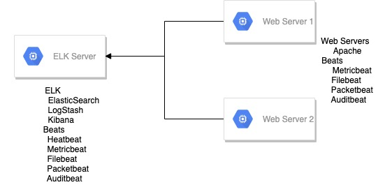

# How to automate deployment of Elasticsearch demo using Ansible 

This repository contains ansible playbooks to build an elasticsearch lab that consists of two apache webservers servers feeding logs into a single node elasticsearch cluster.

This playbook has been tested on the following software versions:

- Server Operating System :
  - Elasticsearch single node-cluster : Ubuntu 22.04
  - Webservers: Ubuntu 22.04

- ELK Stack:
  - Elasticsearch: 7.x
  - Kibana: 7.x

- Beats:
  - Metricbeat: 7.x
  - Filebeat: 7.x
  - Auditbeat: 7.x
  - Packetbeat: 7.x
  - Heatbeat: 7.x

- Misc
  - Apache2: latest
  - Openjdk: 8

## Elasticsearch Lab Architecture

Softwre Installed on each server
- Webservers{Webserver1, Webserver2}:
  - Apache2
  - Metricbeat
  - Filebeat
  - Auditbeat
  - Packetbeat

- Elasticsearch server:
  - openjdk8
  - Elasticsearch
  - Kibana
  - Metricbeat
  - Filebeat
  - Auditbeat
  - Heartbeat

## Requirements

Internet connectivity on each virtual machine to download software.

## Dependencies

- Ansible master server should be able to connect to targer servers.
- Relevant ports should have been opened between elk and web servers
- Relevant ports should be opened to access elasticsearch and kibana

Role Variables
--------------
### vars.yml
  elastic_host: IP address of elaticsearch host

  elastic_port: Elasticsearch port

  kibana_host: IP address of kibana host

  kibana_port: Kibana port

  elastic_protocol: Elasticsearch communication protocol(http/https)

  filebeat_http_port: Filebeat http monitoring port

  auditbeat_http_port: Auditbeat http moniotring port

  heartbeat_http_port: Heartbeat http monitoring port

  packetbeat_http_port: Packetbeat http monitoring port

  web_server_1: IP address of webserver 1

  web_server_2: IP address of webserver 2

### Credentials.yml
  Contains authentication details for built-in elasticsearch users

## Example Playbook

    ---
    # This playbook  will deploy elk stack
    - hosts: elk
      become: yes
      vars_files: 
      - ../vars/credentials.yml
      - ../vars/main.yml
      roles:
      - ../roles/add-elastic-repo
      - ../roles/java
      - ../roles/elasticsearch
      - ../roles/kibana
      - ../roles/metricbeat
      - ../roles/filebeat
      - ../roles/auditbeat
      - ../roles/heartbeat
      - ../roles/config-beats-elastic

## Using Ansible Vault to encrypt credentials file

### How to encrypt sensitive data using ansible vault

    ansible-vault encrypt vars/credentials.yml --vault-password-file vault/.vaultpass

### How to decrypt sensitive data using ansible vault

    ansible-vault decrypt vars/credentials.yml --vault-password-file vault/.vaultpass

### How to run run playbook using vault encrypted credentials

    ansible-playbook -i inventory/hosts.yml playbooks/deploy-elk.yml --vault-password-file vault/.vaultpass

## Other directories

### artifacts
 - design diagrams : Design diagrams for this demo
 - images : Images used in this demo
 - Presentation : Powerpoint presentation used in this    demo

### bash_setup_scripts
- elasticserver_setup.sh : Script to install ELK stack. 
  - Installs elasticsearch, logstash, kibana.
- webserver_shutdown.sh : Script to gracefully shutdown webserver( can be added to shutdown script in GCP ).
  - Stops elasticsearch, logstash and kibana.
- elasticserver_shutdown.sh : Script to gracefully shutdown elastic server.
- webserver_setup.sh : Script to install software on webservers.
  - Installs apache, metricbeat, filebeat, auditbeat.
- webserver_shutdown.sh : Script to gracefully shutdown webserver( can be added to shutdown script in GCP ).
  - Stope metricbeat, filebeat, auditbeat.

### elk_config_files
 - beats : Different beats configuration files.
   - auditbeat
   - filebeat
   - heartbeat
   - metricbeat
   - packetbeat
 - elk : Module configuration files used to configure     various modules on elk server.
   - filebeat
      - elasticsearch.yml
      - kibana.yml
   - heartbeat
      - http.yml
      - icmp.yml
      - tcp.yml
   - metricbeat
      - beat-xpack.yml
      - elasticsearch-xpack.yml
      - kibana-xpack.yml

 - webserver : Module configuration files used to configure various modules on webserver.
   - filebeat
     - apache.yml
   - metricbeat
     - apache.yml
     - beat-xpack.yml

### elk_manual_configuration
 Configurations steps to install and configure elasticsearch demo manually.
 - beats : beat configuration files
           - auditbeat
           - filebeat
           - heartbeat
           - metricbeat
           - packetbeat
 - configure_x_pack_security.md : How to configure x-pack security manually. 
 - elastic_manual_install.md : How to install and configure elasticsearch manually. 

### gcp_configuration
 - network : Commands to configure gcp network settings for this demo using command line
 - ssh-access : Commands to configure os-login for ssh access to gcp environment

 Note: I have used metadata method to access gcp virtual machines instead of os-login.

